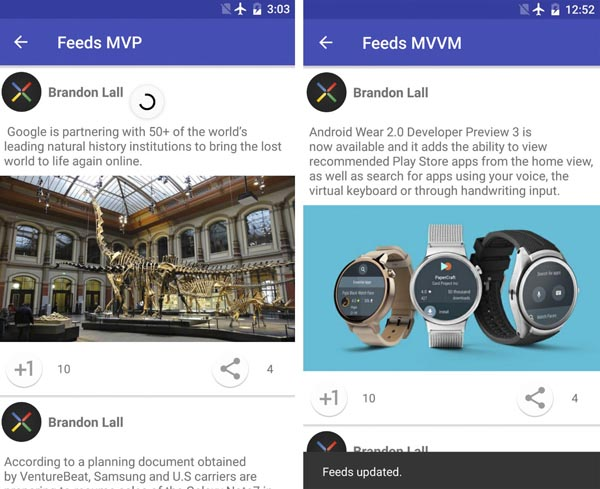

## Feeds-Android
Repository shows differences between architectural patterns that will be able to use in Android app development:
* __MVP__: Model View Presenter.
* __MVVM__: Model View ViewModel based on [data binding library](https://developer.android.com/tools/data-binding/guide.html).

Also repository shows how to use build flawors during development:
* __prod__: uses Retrofit2 web-service.
* __dev__: uses fake web-service & assets.

### The App
The sample app dispalys an example list of feeds from social app.

### Libraries used
* AppCompat, CardView, RecyclerView
* Dagger 2
* Data Binding (for MVVM)
* RxJava, RxAndroid
* Retrofit 2
* Butter Knife
* Picasso
